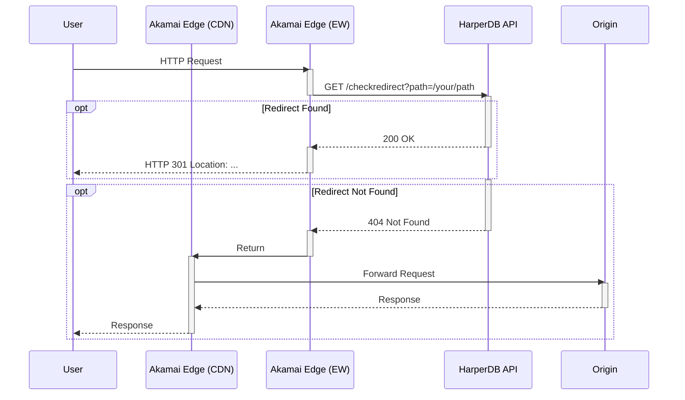

# Akamai EdgeWorker + HarperDB Redirect Template

This repository serves as a template for deploying a high-performance redirect solution (10M+ redirects) using Akamai EdgeWorkers and HarperDB.

Instead of hardcoding redirects in Akamai Property Manager or managing EdgeKV stores, this solution delegates the decision-making logic to a HarperDB API. The EdgeWorker intercepts requests, queries HarperDB, and either issues an immediate redirect or allows the request to proceed to the origin configured on the CDN layer.

## Architecture

The traffic flow is designed to minimize latency while centralizing logic outside of the CDN configuration.



## Features

* **Dynamic Decisioning:** Checks HarperDB for redirect rules in real-time.
* **Infrastructure as Code:** 
  * Includes a GitHub Action ("Bootstrap Akamai Redirect Stack") that provisions the entire stack (EdgeWorker, Akamai Property, Edge Hostname, Harper Redirect Application, Harper Database role/user).
  * Supports uploading a `redirects.json` file to populate rules immediately upon deployment. Subsequent commits of redirects.json will be uploaded to Harper using GitHub Actions, allowing for effective
* **Zero-Trust Setup:** The pipeline automatically generates a strong, unique password for the EdgeWorker, creates a restricted user in HarperDB, and injects the credentials into the EdgeWorker bundle at build time.

## Repository Structure

* **.github/workflows/bootstrap.yml**: The main bootstrap automation pipeline.
* **bootstrap-config.json**: The primary configuration file used to name and size resources.
* **akamai/edgeworker/**: Contains the EdgeWorker source code (`main.js`) and bundle config.
* **akamai/property/**: Contains the Property Manager JSON rule template for a property to front-end requests to Harper.
* **redirects/redirects.json**: Redirect rules to implement in Harper.

## Configuration

The deployment is controlled by `bootstrap-config.json`. You must customize this file before running the workflow.

```json
{
  "akamai_account": {
    "contractId": "ctr_1-ABC",
    "groupId": "grp_12345"
  },
  "akamai_edgeworker": {
    "create": true,
    "name": "harper-redirect-worker",
    "resourceTierId": "200",
    "harperRedirectBaseUrl": "https://harper-redirects.akamaized.net/checkredirect"
  },
  "akamai_property": {
    "create": true,
    "name": "marketing-redirects",
    "productId": "prd_Fresca",
    "network": "enhancedTLS",
    "edgeHostname": "hdb-redirects-customername.akamaized.net",
    "cnameTarget": "hdb-redirects-customername.akamaized.net",
    "originHostname": "harper-redirects.clustername.harperfabric.com",
    "sendHostHeader": "harper-redirects.clustername.harperfabric.com"
  },
  "harper_app": {
    "deploy": true,
    "uploadRedirectJSON": true,
    "deployUrl": "https://harper-redirects.clustername.harperfabric.com",
    "redirectorRepoUrl": "https://github.com/HarperFast/template-redirector",
    "projectName": "harper-redirector"
  }
}
```

### Configuration Details

* **akamai_account**: Your specific contract and group IDs found in Akamai Control Center.
* **akamai_edgeworker**:
    * **harperRedirectBaseUrl**: The endpoint the EdgeWorker will call. This must be a hostname on Akamai. This is injected into the JavaScript source during the bootstrap process.
* **akamai_property**:
    * **edgeHostname**: The target Akamai hostname (must end in `.akamaized.net`).
    * **cnameTarget**: The public hostname (CNAME) you will configure in DNS.
* **harper_app**:
    * **deployUrl**: Your HarperDB instance URL (do not include port).
    * **redirectorRepoUrl**: The package URL for the Harper component to deploy. Should be left as default.

## Secrets and Credentials

To run the workflow, you must configure the following Secrets in your GitHub repository settings.

| Secret Name | Description |
| :--- | :--- |
| `AKAMAI_HOST` | API Endpoint from your `.edgerc` file. |
| `AKAMAI_CLIENT_TOKEN` | Client Token from your `.edgerc` file. |
| `AKAMAI_CLIENT_SECRET` | Client Secret from your `.edgerc` file. |
| `AKAMAI_ACCESS_TOKEN` | Access Token from your `.edgerc` file. |
| `HARBOR_USER` | Username for HarperDB/Harbor authentication (Platform User). |
| `HARBOR_PASSWORD` | Password for HarperDB/Harbor authentication. |

*Optional:* If you are using a partner account, you may define `ACCOUNT_SWITCH_KEY` as a repository variable.

*Note:* Akamai API credentials should have the following permissions:
* EdgeWorkers READ-WRITE
* Property Manager (PAPI) READ-WRITE

Harper user should have admin permissions.

## The Bootstrap Workflow

The workflow is a manual dispatch process. When triggered, it performs the following steps:

1.  **Harper Deployment**:
    * Deploys the specified redirector application to your Harper instance.
    * Waits for the application to report a healthy status.
    * Ensures a `redirects_reader` role exists.
    * **Security Step**: Generates a random username and password, creates this user in HarperDB, and base64 encodes the credentials.
2.  **EdgeWorker Build**:
    * Injects the base64 Harper credential token into `main.js`.
    * Injects the Harper Base URL into `main.js`.
    * Bundles and uploads the EdgeWorker to Akamai.
    * Activates the EdgeWorker on the Staging network.
3.  **Property Provisioning**:
    * Creates the Edge Hostname via PAPI (if it does not exist).
    * Creates or updates the Property configuration based on the local JSON template.
    * Updates the hostname mappings.
    * Activates the Property on the Staging network.
4.  **Data Ingestion**:
    * Uploads the contents of `redirects/redirects.json` to the HarperDB instance to initialize the rule set.

## Redirect Rules Format

To define redirects, edit `redirects/redirects.json`.
* Further details can be found in Harpers GitHub: https://github.com/HarperFast/template-redirector

| Name | Required | Description |
| :--- | :--- | :--- | 
| `utcStartTime` | No | Time in unix epoch seconds to start applying the rule. |
| `utcEndTime` | No | Time in unix epoch seconds to stop applying the rule. |
| `path` | Yes | The path to match on. This can be the path element of the URL or a full url. If it is the full URL the host will populate the host field below. |
| `redirectURL` | Yes | The path or URL to redirect to. |
| `host` | No | The host to match on as well as the path. If empty, this rule can apply to any host. See ho below. |
| `version` | No | Defaults to the current active version. The version that applies to this rule. See the version table below. |
| `operations` | No | Special operation on the incoming / outgoing path (See Harper documentation). |
| `statusCode` | Yes | HTTP status code for the redirect (default: 301). |
| `regex` | No | 1 == path is a regex. Default is 0. |

```json
{
	"data": [
		{
			"utcStartTime": "",
			"utcEndTime": "",
			"path": "/shop/live-shopping",
			"host": "",
			"version": "0",
			"redirectURL": "/s/events",
			"operations": "",
			"statusCode": "301",
			"regex": 0
		}
	]
}
```

## Local Development

If you wish to edit the EdgeWorker logic:
1.  Navigate to `akamai/edgeworker/`.
2.  Modify `main.js`.
3.  Ensure you do not remove the placeholder strings `HARPER_TOKEN` or `HARPER_BASE_URL`, as the CI pipeline relies on these.