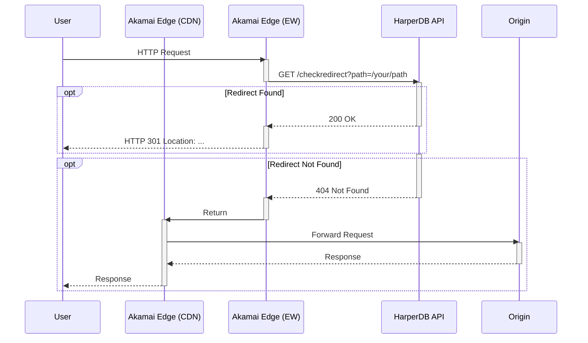

# Akamai EdgeWorker + HarperDB Redirect Template

This repository serves as a template for deploying a high-performance redirect solution (10M+ redirects) using Akamai EdgeWorkers and HarperDB.

Instead of hardcoding redirects in Akamai Property Manager or managing EdgeKV stores, this solution delegates the decision-making logic to a HarperDB API. The EdgeWorker intercepts requests, queries HarperDB, and either issues an immediate redirect or allows the request to proceed to the origin configured on the CDN layer.

## Request Flow



## Features

* **Infrastructure as Code:** 
  * Includes a GitHub Action Workflow ("Bootstrap Akamai Redirect Stack") that provisions the entire stack (EdgeWorker, Akamai Property, Edge Hostname, Harper Redirect Application, Harper Database role/user).
  * Supports uploading a `redirects.json` file to populate rules immediately upon deployment. Subsequent commits of redirects.json will be reconciled to Harper using GitHub Actions. This keeps your HarperDB cluster in sync with your redirects.json file, making this repository the source of truth for redirects.
* **Zero-Trust Setup:** The pipeline automatically generates a strong, unique password for the EdgeWorker, creates a restricted user in HarperDB, and injects the credentials into the EdgeWorker bundle at build time.

## Repository Structure
```
.
├── README.md
├── .github
│   └── workflows
│       └── bootstrap-akamai.yml                      # GitHub Action Workflow for bootstrapping Akamai Redirect Stack
│       └── manage-harper-redirects.yml               # GitHub Action Workflow for managing Harper Redirects
├── akamai
│   ├── edgeworker
│   │   ├── bundle.json                               # Akamai EdgeWorker bundle configuration
│   │   └── main.js                                   # Akamai EdgeWorker source code
│   └── property
│       └── harper-redirect-template.v1.default.json  # Akamai Property Manager JSON rule template
├── bootstrap-config.json                             # Bootstrap configuration file
└── harper-redirects
    └── redirects.json                                # Redirect rules to implement in Harper
```
## Prerequisites

* Akamai API credentials with the following permissions:
  * EdgeWorkers READ-WRITE
  * Property Manager (PAPI) READ-WRITE
* Akamai Account Details
  * Contract ID
  * Group ID
* Harper Fabric Account
  * Harper Cluster
  * Harper Superuser Credentials
  * Harper URL

## 1. Gather Prerequisites
1. Create Akamai API Credentials: [Documentation](https://techdocs.akamai.com/onboard/docs/set-up-identity-and-access-api#4-set-up-authentication-credentials)
2. Gather Akamai Account Details:
   * Contract ID: Hamburger Menu > Account Admin > Contracts
   * Group ID: 
3. Create Harper Cluster
   * If needed create Harper Fabric account: [Documentation](https://fabric.harper.fast/#/sign-up)
   * Create cluster in Fabric: [Documentation](https://docs.harperdb.io/docs/getting-started/installation#manage-and-deploy-with-fabric)
   * Grab cluster URL and superuser credentials

## 2. Clone or Fork Repository

```bash
  git clone https://github.com/akamai-consulting/harper-akamai-redirect-template
  cd harper-akamai-redirect-template
  git remote add origin <your-github-repo-url>
```

## 3. Configure Repository Secrets

To run the workflow, you must configure the following Secrets in your GitHub repository settings under Settings > Secrets and variables > Actions.

| Secret Name | Description |
| :--- | :--- |
| `AKAMAI_HOST` | API Endpoint from your `.edgerc` file. |
| `AKAMAI_CLIENT_TOKEN` | Client Token from your `.edgerc` file. |
| `AKAMAI_CLIENT_SECRET` | Client Secret from your `.edgerc` file. |
| `AKAMAI_ACCESS_TOKEN` | Access Token from your `.edgerc` file. |
| `HARBOR_USER` | Username for HarperDB/Harbor authentication (superuser). |
| `HARBOR_PASSWORD` | Password for HarperDB/Harbor authentication. |

*Optional:* If you are using a partner account, you may define `ACCOUNT_SWITCH_KEY` as a repository variable.

*Note:* Akamai API credentials should have the following permissions:
* EdgeWorkers READ-WRITE
* Property Manager (PAPI) READ-WRITE

Harper user should have admin permissions.

## 4. Configure Bootstrap Workflow

The bootstrap workflow is controlled by `bootstrap-config.json`. You must customize this file before running the workflow to deploy the stack.

```json
{
  "akamai_account": {
    "contractId": "ctr_1-ABC", # Found in Akamai Control Center > Hamburger Menu > Account Admin > Contracts
    "groupId": "grp_12345" 
  },
  "akamai_edgeworker": {
    "create": true, # Set to false if you already have an EdgeWorker
    "name": "harper-redirect-worker", # Name of EdgeWorker
    "resourceTierId": "200", # Dynamic Compute Tier ID
    "harperRedirectBaseUrl": "https://harper-redirects.akamaized.net" # Base URL for Harper Redirects. Used in akamai_property to front end requests to Harper from EW
  },
  "akamai_property": {
    "createProperty": true, # Set to false if you already have a property
    "createHostname": true, # Set to false if you already have a hostname
    "name": "harper-redirects", # Name of Property
    "productId": "prd_Fresca", # Product ID: prod_Fresca = ION Standard; prd_SPM = ION Premier
    "edgeHostname": "hdb-redirects-customername.akamaized.net", # Edge Hostname
    "originHostname": "harper-redirects.clustername.harperfabric.com", # Harper Hostname
    "sendHostHeader": "harper-redirects.clustername.harperfabric.com" # Host Header to send to Harper
  },
  "harper_app": {
    "deploy": true, # Set to false if you already have a Harper Redirect App
    "uploadRedirectJSON": true, # Set to false if you do not wish to deploy redirects to Harper during bootstrap
    "deployUrl": "https://harper-redirects.clustername.harperfabric.com", # Harper URL
    "redirectorRepoUrl": "https://github.com/HarperFast/template-redirector", # Harper Redirector Repo URL
    "projectName": "harper-redirector" # Harper Project Name
  }
}
```

## 5. Configure Redirect Rules

To define redirects, edit `redirects/redirects.json`.

| Name | Required | Description |
| :--- | :--- | :--- | 
| `utcStartTime` | No | Time in unix epoch seconds to start applying the rule. |
| `utcEndTime` | No | Time in unix epoch seconds to stop applying the rule. |
| `path` | Yes | The path to match on. This can be the path element of the URL or a full url. If it is the full URL the host will populate the host field below. |
| `redirectURL` | Yes | The path or URL to redirect to. |
| `host` | No | The host to match on as well as the path. If empty, this rule can apply to any host. See ho below. |
| `version` | No | Defaults to the current active version. The version that applies to this rule. See the version table below. |
| `operations` | No | Special operation on the incoming / outgoing path (See Harper documentation). |
| `statusCode` | Yes | HTTP status code for the redirect (default: 301). |
| `regex` | No | 1 == path is a regex. Default is 0. |

```json
{
	"data": [
		{
			"utcStartTime": "",
			"utcEndTime": "",
			"path": "/shop/live-shopping",
			"host": "",
			"version": "0",
			"redirectURL": "/s/events",
			"operations": "",
			"statusCode": "301",
			"regex": 0
		}
	]
}
```
* Further details on the format can be found in Harpers GitHub: https://github.com/HarperFast/template-redirector

## 6. Commit and Push 

Commit and push the changes to your repository. 

```bash
  git add bootstrap-config.json
  git add redirects/redirects.json
  git commit -m "Initial commit for bootstrap workflow"
  git push origin main
```

## 7. Run the Bootstrap Workflow

The workflow is a manual dispatch process. When triggered, it performs the following steps:

1.  **Harper Deployment**:
    * Deploys the specified redirector application to your Harper cluster.
    * Waits for the application to report a healthy status.
    * Ensures a `read_only_user` role exists.
    * Generates a username and password, creates this user in HarperDB, assigns the `read_only_user` role, and base64 encodes the credentials.
2.  **EdgeWorker Build**:
    * Injects the base64 Harper credential token into `main.js`.
    * Injects the Harper Base URL into `main.js`.
    * Bundles and uploads the EdgeWorker to Akamai.
    * Activates the EdgeWorker on the Staging and Production networks.
3.  **Property Provisioning**:
    * Creates the Edge Hostname via PAPI (if it does not exist).
    * Creates or updates the Property configuration based on the local JSON template.
    * Updates the hostname mappings.
    * Activates the Property on the Staging and Production networks.
4.  **Data Ingestion**:
    * Uploads the contents of `redirects/redirects.json` to the HarperDB instance to populate initial redirect rules.

### Trigger Workflow

To trigger the workflow, navigate to the Actions tab in your GitHub repository and click on the "Bootstrap" workflow, then click "Run Workflow".


## 8. Add Edgeworker to your Akamai Property

After the bootstrap workflow has completed, you can add the EdgeWorker to the Akamai property where you want redirects to be implemented.

1. Navigate to your Akamai Property and add the EdgeWorker behavior: [Documentation](https://techdocs.akamai.com/edgeworkers/docs/add-the-edgeworkers-behavior)
2. Save & Deploy the property to staging.
3. Test the redirects in staging
    * If needed, debug with Enhanced Debug Headers: [Documentation](https://techdocs.akamai.com/edgeworkers/docs/enable-enhanced-debug-headers)

## Ongoing Management

### Update Redirects

A separate workflow (manage-harper-redirects.yml) is provided to update redirects in HarperDB. To trigger the workflow, simply modify `redirects/redirects.json` and push the changes to your repository. The workflow will do two things:
1. Compare the new version of redirects.json to the previously commited version and delete any redirects on HarperDB that are no longer present.
2. Upload the new version of redirects.json to HarperDB.

This keeps your HarperDB cluster in sync with your redirects.json file, making this repository the source of truth for redirects.

### Update Edgeworker

A separate workflow is provided to update the Edgeworker. To trigger the workflow, simply modify `main.js` and `bundle.json` and push the changes to your repository. The workflow will automatically detect the changes and update the Edgeworker in Akamai staging.